# Objective

Create a basic virtual malware lab on using VitualBox on a laptop.


An isolated network will be used for guest communication. One of the guests will act as a gateway/firewall and connect the isolated network to the internet via NAT.


The guests will include base machines, which will then be used to create multiple linked clones.

# Issues
The iptables configuration, as shown below is too permissive.
It will allow unrestricted access to the internet from the isolated network, if accessing directly via IP address without a DNS lookup.

Need to find an easier way to deny by default, log traffic and keep a whitelist of allowed destinations.

# Rationale for not using vlabs
- performance: no network lag
- usability: native rendering instead of browser rendering
- networking: vlabs have no internet access
- get to keep setup after course is over
- learn to setup lab
- learn virtualbox

# Architecture


# Hardware
A 5 year old dell laptop, with taped up microphone and camera.
- quad-core i7
- 8gb DDR3
- 128GB SSD

# BIOS
Ensure disabled
- usb
- com
- lpt
- bluetooth
- C-steps

Ensure enabled
- virtualization


# Host OS
Ubuntu 16.04.1

## Download
http://releases.ubuntu.com/xenial/ubuntu-16.04-desktop-amd64.iso

## Install
- Burn iso and boot
- do not tick the "install third party stuff" checkbox
- auto partitioning
  - full disk encryption using LVM
  - 500MB unencrypted "/boot" partition
  - 117GB encrypted "/" partition
  - 8GB encrypted swap

## Configure
Set up aliases
```
echo "alias canihaz='sudo apt-get install'" >> ~/.bashrc
echo "alias updates='sudo apt-get update && sudo apt-get upgrade -y'" >> ~/.bashrc
etc...
```

Set up networking
- disable ipv6 on eth0

Flick through control panel
  - edit leaky "privacy and security" settings
  - aggressive update settings, but no dist-upgrade
  - adjust power settings

Install
  - updates
    - ```updates```
  - VirtualBox
    - ```canihaz virtualbox```
  - IDS
    - Not sure here.
    - TripWire is commercial.
    - OSSEC requires server?

# Guests
- 1 x Remnux (gateway) - 64-bit
- 2 x Kali (helpers) - 64-bit
- 2 x Windows 7 (victims) - 32-bit

# Networking reference
Remnux
- eth0
  - NAT / DHCP
- eth1
  - 192.168.3.1
  - 255.255.255.0
  - intnet

Kali 1
- 192.168.3.101
- 255.255.255.0
- intnet

Kali 2
- 192.168.3.102
- 255.255.255.0
- intnet

Victim 1
- 192.168.3.201
- 255.255.255.0
- intnet

Victim 2
- 192.168.3.202
- 255.255.255.0
- intnet

# Download guests
- https://docs.google.com/uc?id=0B6fULLT_NpxMampUWlBCQXVJZzA&export=download
- http://cdimage.kali.org/kali-2016.2/
- http://www.robertmcardle.com/Teaching/VM/


# Install remnux

## Import OVA/OVF file
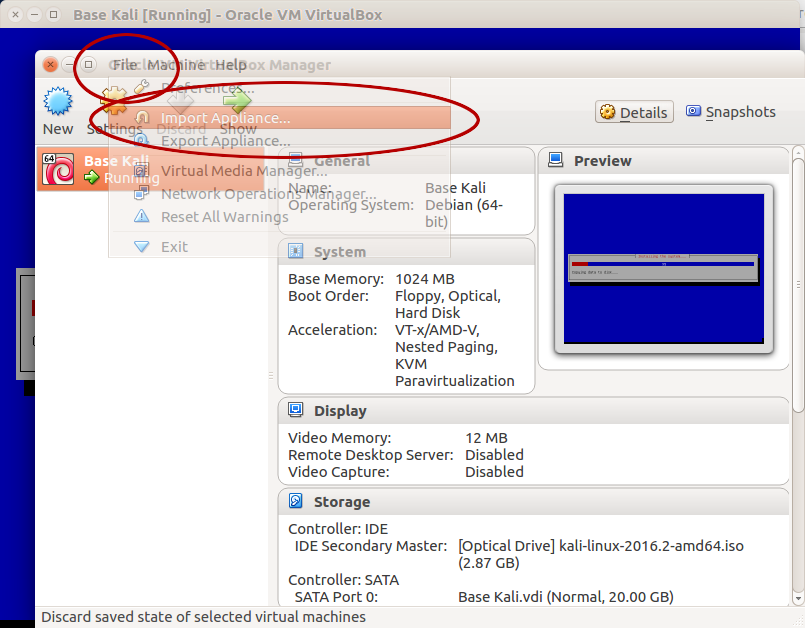


## Set up network interfaces
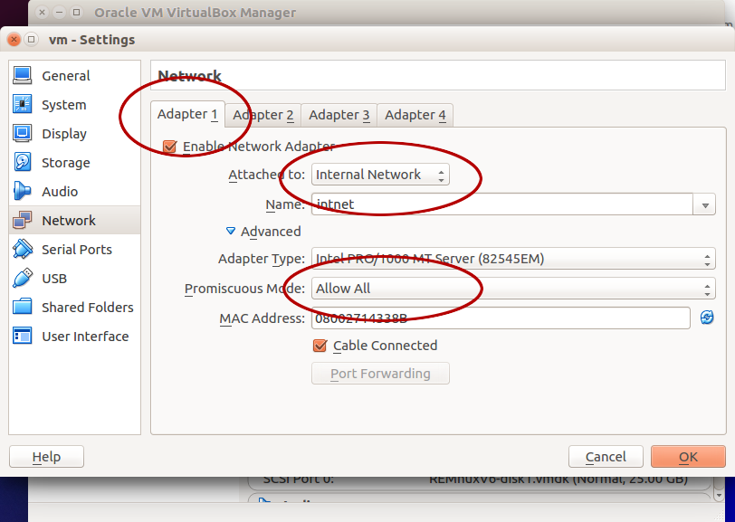
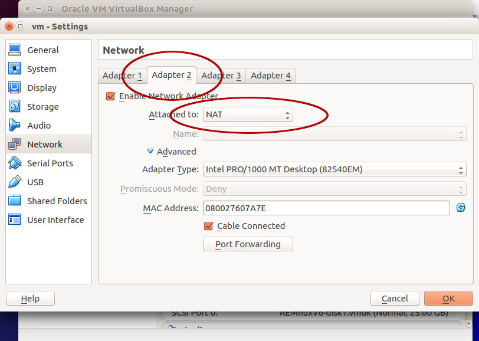

## Take snapshot
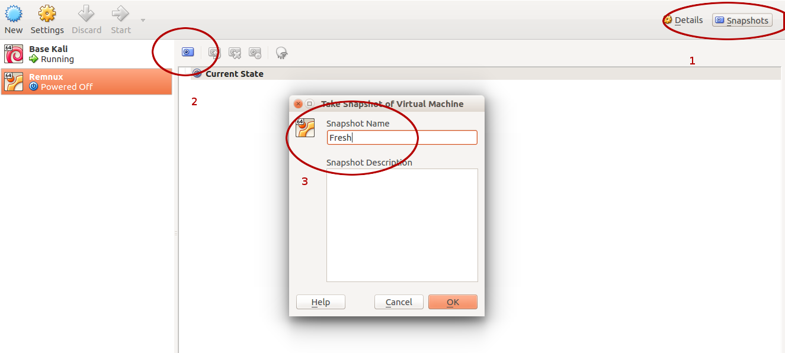

## Configure
- install virtualbox guest additions [command in footnote]
- add fakedns to startup https://askubuntu.com/questions/814/how-to-run-scripts-on-start-up/816#816
- enable port forwarding https://unix.stackexchange.com/questions/126595/iptables-forward-all-traffic-to-interface
- set up networking, edit:

#### /etc/network/interfaces
```
# Loopback interface
auto lo
iface lo inet loopback

# Internet
auto eth0
iface eth0 inet dhcp

# Internal Network
auto eth1
iface eth1 inet static
  address 192.168.3.1
  netmask 255.255.255.0
```

- shutdown
- take another snapshot


# Install Kalis
## create new VM
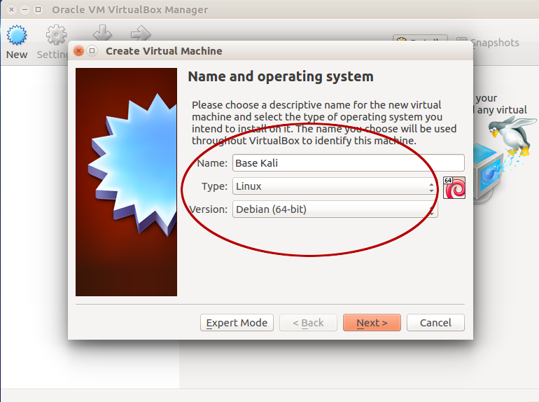

## set up disk
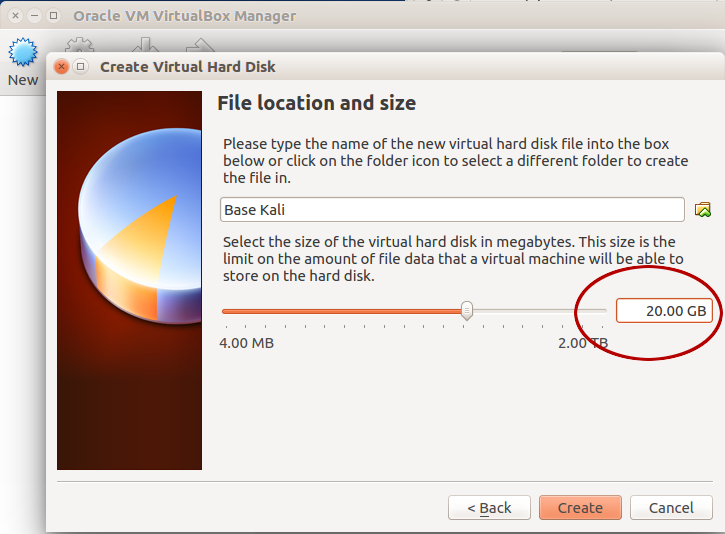

## set up networking
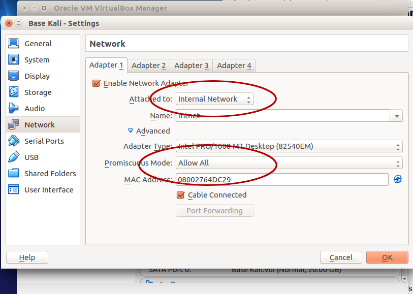

## attach iso to optical drive
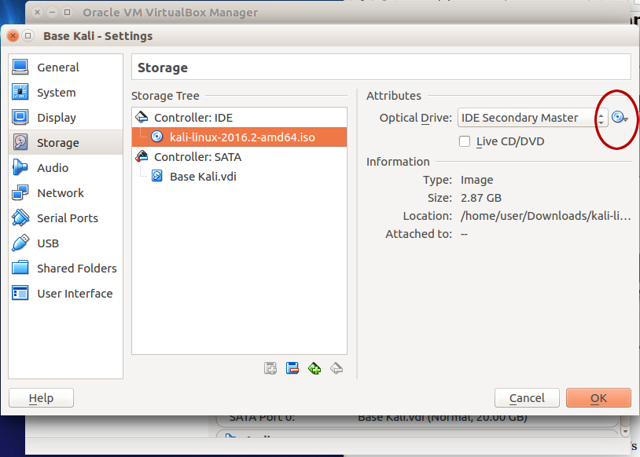

## boot
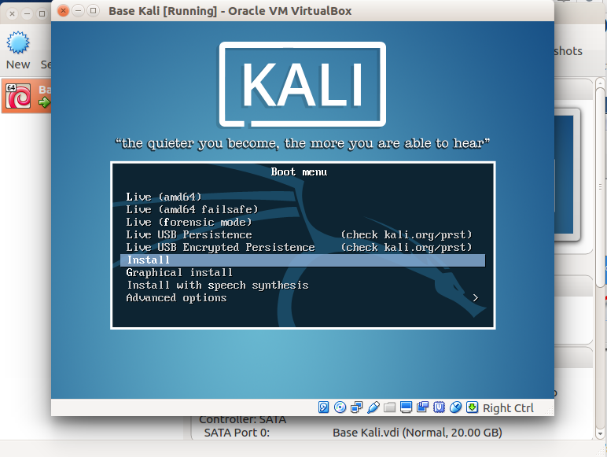

## default install, skip networking
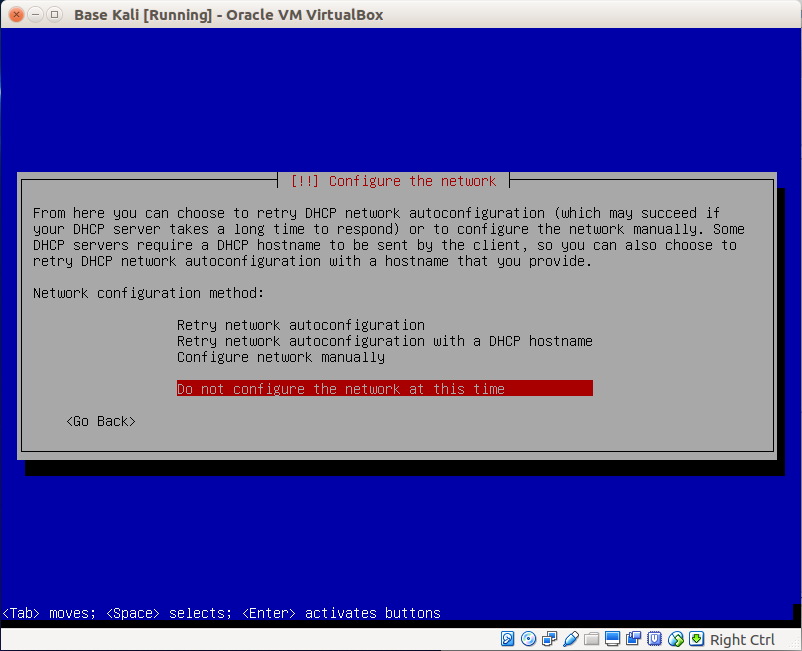

- reboot
- install updates
- shutdown
- take snapshot

## Disable screensaver


## Configure
- install virtualbox guest additions [command in footnote]
- shutdown
- take snapshot

## create linked clones

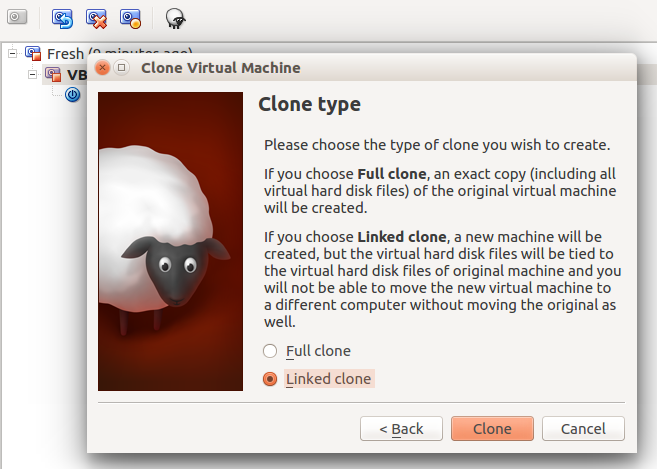

## Configure networking on linked clones

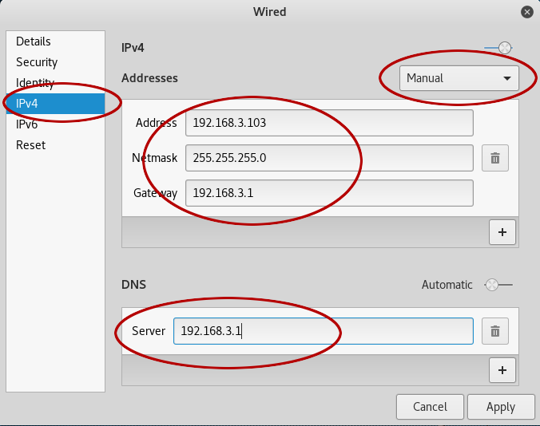


# Install victims
## delete manifest file, otherwise, you will get the below error


## Set up network interface


## Other config
- add optical drive in virtualbox
- reduce RAM from 3GB to 2.5GB

## Install
- Import OVA/OVF file

## Configure
- install virtualbox guest additions
- reduce font size to 100%
- shutdown
- take snapshot
- create linked clones

## Configure networking on linked clones
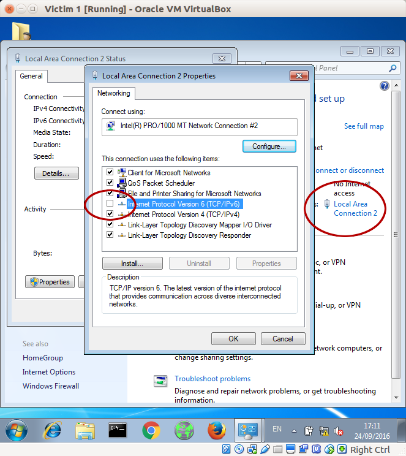
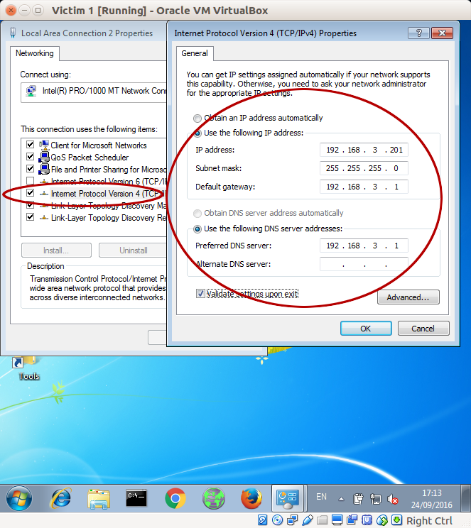
- shutdown
- take snapshot


# Done
This is what I ended up with

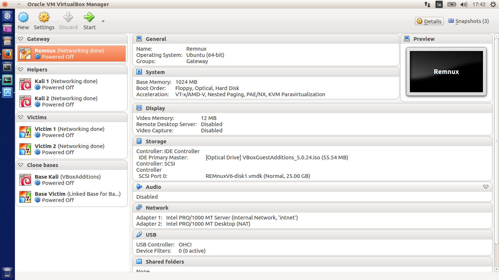
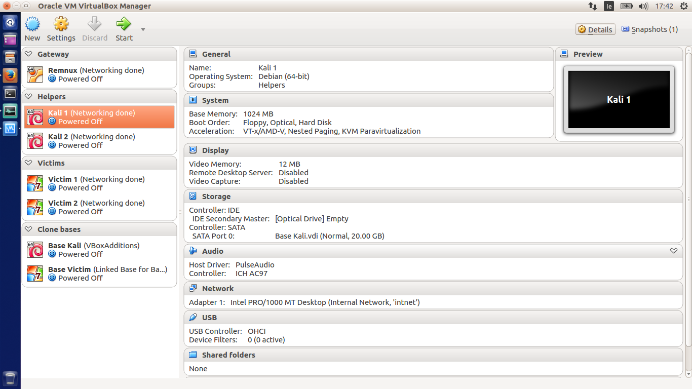
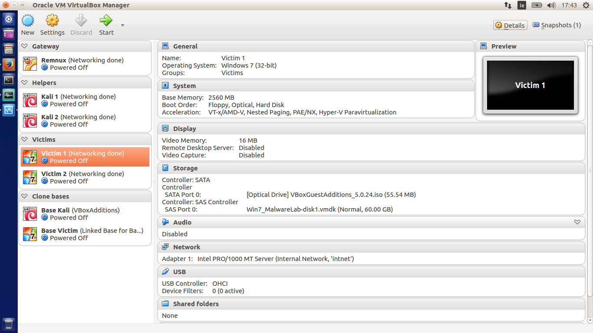
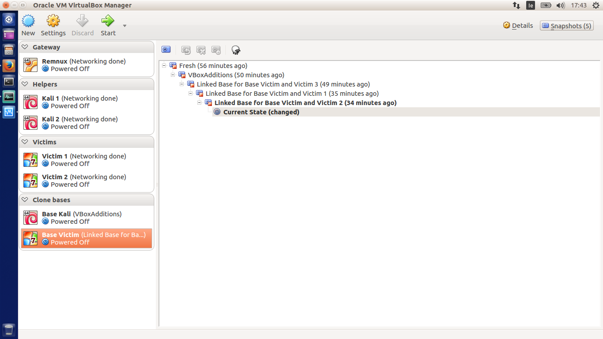

### Watch out
The memory gets eaten up rather quick with the number of running vms and the host might become unresponsive and/or die.
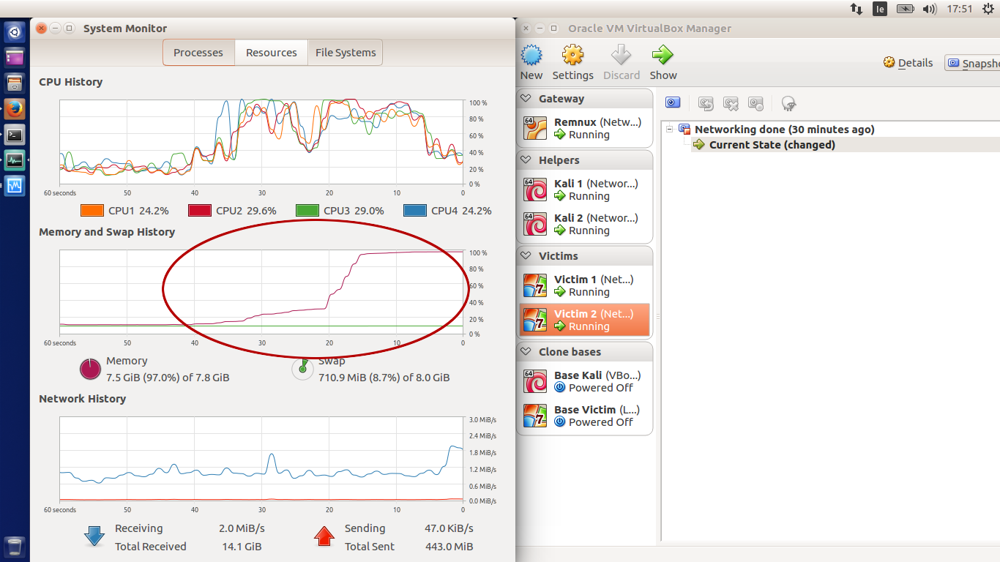


# Footnotes
[Install VirtualBox additions on linux]
```
mount additions image (devices -> insert guess additions cd)
cd /media/cdrom0
cp VBoxLinuxAdditions.run ~
cd ~
chmod +x VBoxLinuxAdditions.run
./VBoxLinuxAdditions.run
sudo reboot
```
